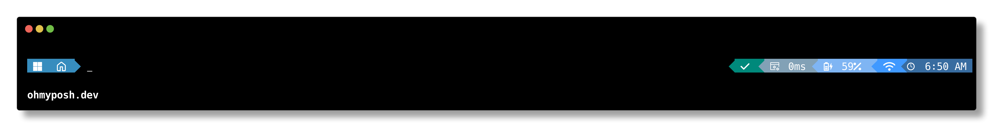

# AymanTheme
AymanTheme is a Oh My posh Theme



# installition
1. First You need [Oh My Posh](https://github.com/JanDeDobbeleer/oh-my-posh)

then apply theme

1. Clone the repo
```
git clone https://github.com/AymanAbuAli/AymanTheme.git
```

2. Open powershell profile with

`notepad $PROFILE`

and replace the oh my posh line 

`oh-my-posh init pwsh | Invoke-Expression
` 

with this line
```
oh-my-posh init pwsh --config "/Path/To/ayman.omp.json" | Invoke-Expression
```